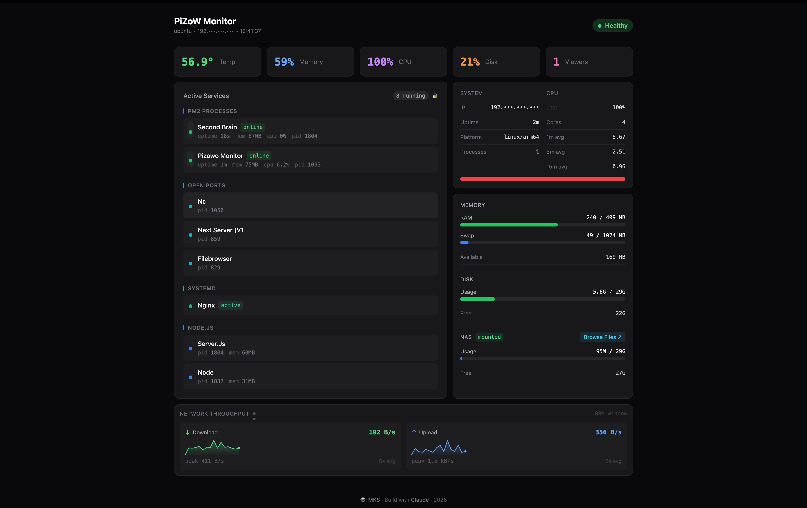
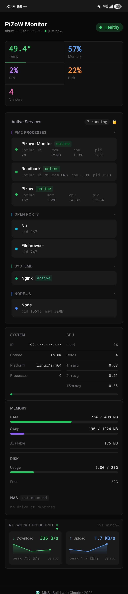
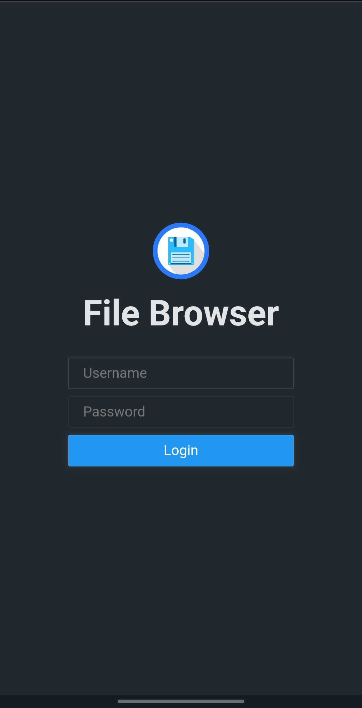
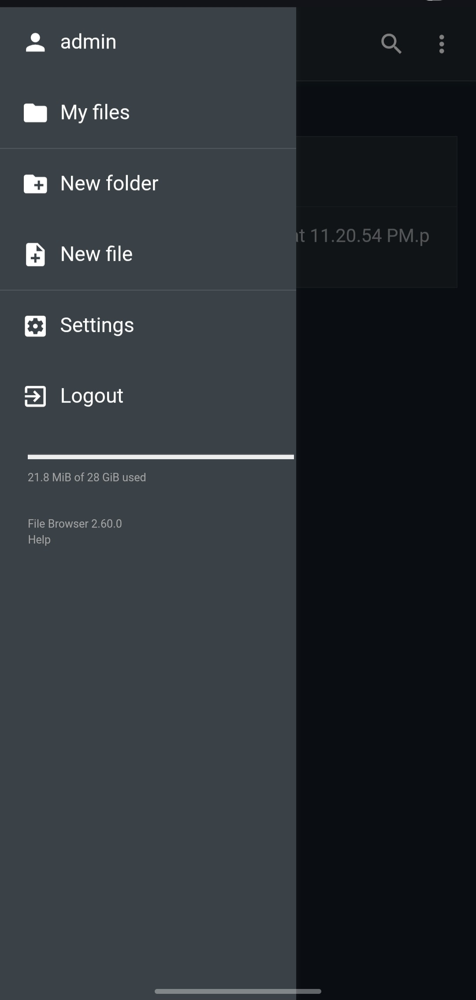

# PiZoW

> Turn your Raspberry Pi Zero W into a lightweight home server — with deployment scripts, process management, a real-time monitoring dashboard, and NAS storage via USB.


<table>
  <tr>
    <td><a href="screenshot/web-dashboard.png"></a></td>
    <td><a href="screenshot/mobile.jpg"></a></td>
  </tr>
</table>

### NAS — File Browser

File Browser runs at `http://PI_IP:8080` after `setup-nas.sh`. Accessible from any device on your network.

<table>
  <tr>
    <td><a href="screenshot/mobile-nas.jpg"></a></td>
    <td><a href="screenshot/mobile-nas2.jpg"></a></td>
  </tr>
</table>

---

## What is PiZoW?

PiZoW is a collection of shell scripts and a ready-to-use example project that makes it dead simple to:

- **Set up** a Raspberry Pi Zero W as a Node.js web server
- **Deploy** any Node.js app (Next.js, Express, Fastify, etc.) from your local machine
- **Monitor** your Pi in real time with a beautiful dashboard
- **Turn any USB storage into a NAS** — NFS share + File Browser web UI, fully integrated into the dashboard

The included **Next.js example** doubles as a fully functional **monitoring dashboard** for your Pi home server — showing CPU, memory, disk, temperature, network throughput, NAS storage, uptime, and all running services in a single-page view. It's both a demo project and something you'll actually want to keep running.

---

## Quick Start

### 1. Flash Your SD Card

Use [Raspberry Pi Imager](https://www.raspberrypi.com/software/):

**Settings (click the gear icon ⚙️):**
- Enable SSH
- Set username and password
- Configure WiFi
- Set locale

**OS: Ubuntu Server 24.04 LTS (recommended)**

> **Built and tested on a Raspberry Pi Zero 2 W** running Ubuntu Server 24.04.4 LTS. All scripts are written to work on any Raspberry Pi model (Zero, Zero 2 W, 3, 4, 5) and any Debian-based OS.
>
> **Recommended OS: Ubuntu Server 24.04 LTS** — it has the best out-of-the-box support for Node.js, systemd, NFS, and package availability. Raspberry Pi OS Lite works too but may require extra steps for some packages. Always choose the **server (headless)** variant — no desktop needed.
>
> The NAS setup uses the USB OTG port which is specific to Pi Zero models. On Pi 3/4/5, connect your drive to any regular USB port — power limits are much higher so HDDs work fine.

### 2. SSH into Your Pi & Set Up Key Auth

```bash
ssh YOUR_USERNAME@YOUR_PI_IP
ssh-copy-id YOUR_USERNAME@YOUR_PI_IP   # recommended — enables passwordless deploys
```

> `PI_PASSWORD` in `.env` is only needed for the first `setup-pi.sh` run. Once your SSH key is installed you can remove it — all subsequent deploys use key auth.

### 3. Run the Setup Script

On your Pi:

```bash
curl -sSL https://raw.githubusercontent.com/YOUR_USERNAME/pizow/main/scripts/setup-pi.sh | bash
```

Or clone and run locally:

```bash
git clone https://github.com/YOUR_USERNAME/pizow.git
cd pizow
./scripts/setup-pi.sh
```

This installs Node.js 22, PM2, Nginx, and configures 1 GB swap (essential for Pi Zero).

### 4. Configure Your Environment

```bash
cp .env.example .env
```

Edit `.env`:

```bash
PI_USER=your_username
PI_HOST=192.168.x.x
PROJECT_NAME=myapp
PROJECT_PATH=/home/your_username/myapp
LOCAL_PATH=/path/to/your/local/project   # for local deploy
REPO_URL=git@github.com:you/myapp.git    # for remote deploy
BRANCH=main                              # branch to pull (remote mode)
PORT=3000
PM2_APP_NAME=myapp
FB_PASSWORD=your_password                # File Browser admin password (required for setup-nas.sh)
```

### 5. Deploy

```bash
# Build on your Mac, rsync output to Pi (recommended for Pi Zero — less RAM pressure)
./scripts/deploy.sh

# Or have the Pi pull from GitHub and build itself
./scripts/deploy.sh --remote

# Just restart without rebuilding
./scripts/deploy.sh --restart
```

---

## Deploy the Monitoring Dashboard

The `examples/nextjs` app is ready to deploy as-is. It runs as your Pi's home dashboard.

```bash
# Set LOCAL_PATH to the nextjs example in your .env
LOCAL_PATH=./examples/nextjs

# Deploy it
./scripts/deploy.sh
```

Then open `http://YOUR_PI_IP` in any browser on your network.

---

## Project Structure

```
pizow/
├── scripts/
│   ├── setup-pi.sh          # One-time Pi setup (Node, PM2, Nginx, swap)
│   ├── setup-nas.sh         # NAS setup (ext4, NFS, File Browser, udev auto-remount)
│   ├── reset-nas.sh         # Wipe all NAS components for a fresh setup
│   ├── deploy.sh            # Deploy via local rsync or git pull
│   ├── deploy-standalone.sh # Build locally + rsync prebuilt output
│   ├── nginx-setup.sh       # Configure Nginx reverse proxy
│   ├── health-check.sh      # Pi health check (CPU, mem, disk, temp)
│   └── manage.sh            # List, stop, kill, remove deployed apps
├── examples/
│   ├── nextjs/              # Monitoring dashboard + Next.js demo
│   └── node-api/            # Express API with health, echo, CRUD endpoints
├── .env.example
└── README.md
```

---

## Scripts Reference

### `setup-pi.sh`

Run once on a fresh Pi. Installs and configures everything:

- Node.js 22.x
- PM2 (process manager with autostart)
- Nginx (reverse proxy)
- 1 GB swap file

### `setup-nas.sh`

Turns your Pi into a NAS using any USB storage drive.

```bash
# Run from your Mac (auto-forwards to Pi via SSH)
./scripts/setup-nas.sh

# Or run directly on the Pi
./scripts/setup-nas.sh --local
```

**What it does:**

| Component | Details |
|-----------|---------|
| Format | ext4 — full Linux permissions and ownership support |
| Mount | Auto-mounts at `/mnt/nas` on every boot via `/etc/fstab` |
| Auto-remount | udev rule re-mounts automatically when drive is plugged in |
| NFS server | Network share — mount on Mac/Linux as a network drive |
| File Browser | Web UI at `http://PI_IP:8080` — browse, upload, download |
| Dashboard | NAS usage card + network throughput shown in monitoring dashboard |

**Step-by-step what the script does:**

1. **Detect USB drive** — scans for USB block devices (`lsblk -rno NAME,TYPE,TRAN`), picks the first one. Fails clearly if nothing is found.
2. **Install packages** — `e2fsprogs` (ext4 tools), `nfs-kernel-server`, `curl`
3. **Format as ext4** — wipes the drive, creates a GPT partition table, formats as ext4 with label `pizow-nas`. Skips if already mounted.
4. **Auto-mount via fstab** — reads the UUID with `blkid`, adds an entry to `/etc/fstab` so the drive mounts at `/mnt/nas` on every boot. Creates default folders: `media/`, `docs/`, `backup/`.
5. **NFS server** — exports `/mnt/nas` to your local subnet (`192.168.1.0/24` by default, edit `NFS_SUBNET` in the script). Enables and starts `nfs-kernel-server`.
6. **File Browser** — downloads the File Browser binary for your Pi's architecture (arm64 for Pi Zero 2 W, armv7 for original Pi Zero). Configures it with `/mnt/nas` as root, creates an admin user, installs as a systemd service.
7. **NAS stats API** — a minimal bash HTTP server on port 8081 returning drive stats as JSON, used by the monitoring dashboard.
8. **udev auto-remount rule** — installs `/etc/udev/rules.d/99-pizow-nas.rules` so the drive auto-remounts when plugged in after boot.

**Prerequisites:**
- SSH key auth set up (`ssh-copy-id`) — recommended. If not, set `PI_PASSWORD` in `.env` and install `sshpass` on your Mac (`brew install sshpass`) so the script can forward itself to the Pi.

**Hardware requirements:**
- USB OTG adapter (Micro-USB → USB-A) — required for Pi Zero
- **Flash drives recommended over spinning HDDs on Pi Zero** — see power note below
- Drive must be connected and visible (`lsblk` shows a USB disk) before running

> **⚠️ Power / HDD Warning**
>
> The Pi Zero's USB OTG port provides **~500mA at 5V** — enough for a flash drive, but **not enough for a 2.5" spinning hard drive** (which typically draws 700–1000mA at spin-up). Plugging in an HDD may cause:
> - The drive to not spin up at all (not detected by `lsblk`)
> - The Pi to brown-out and reboot
> - Intermittent disconnects under load
>
> **Use a flash drive** for Pi Zero. If you need large storage with an HDD, use a **powered USB hub** between the Pi and the drive.

**Mount behavior:**
- Pi boots with drive plugged in → auto-mounts via fstab ✓
- Pi boots without drive → boots fine, `/mnt/nas` stays empty (`nofail`) ✓
- Plug in drive after boot → udev rule auto-remounts within seconds ✓

**Connect from Mac:**
```bash
# NFS
sudo mkdir -p /Volumes/pizow-nas
sudo mount -t nfs PI_IP:/mnt/nas /Volumes/pizow-nas

# Or via Finder: Go → Connect to Server → nfs://PI_IP/mnt/nas
```

**Connect from Linux:**
```bash
sudo mount -t nfs PI_IP:/mnt/nas /mnt/pizow-nas
```

> **File Browser credentials:** `admin` / your `FB_PASSWORD` — must be set in `.env` before running the script. Change after first login at `http://PI_IP:8080`

### `deploy-standalone.sh`

An alternative to `deploy.sh` specifically for Next.js standalone builds. Builds locally and rsyncs only the prebuilt output — no `node_modules` copied, minimal footprint on the Pi.

```bash
./scripts/deploy-standalone.sh              # full build + deploy
./scripts/deploy-standalone.sh --skip-build # deploy existing build (skip npm run build)
```

Uses `BUILD_DIR` from `.env` (defaults to `examples/nextjs`). Starts the app directly with `node server.js` via nohup — not PM2. Logs go to `/tmp/pizow.log` on the Pi.

> Use `deploy.sh` for general use (PM2 managed). Use `deploy-standalone.sh` if you want a quick, no-PM2 deploy of the Next.js example.

### `reset-nas.sh`

Wipes all NAS components so you can run `setup-nas.sh` fresh. **Does not delete data on the USB drive itself.**

```bash
./scripts/reset-nas.sh
```

Removes: File Browser service + binary + db, NAS stats API service, NFS exports, fstab entry, mount point, udev rule.

### `deploy.sh`

```bash
./scripts/deploy.sh [--local] [--remote] [--restart]
```

| Flag | Description |
|------|-------------|
| `--local` | Build on your machine, rsync output to Pi (default) |
| `--remote` | Pi pulls from git and builds there |
| `--restart` | Skip build/sync, just restart PM2 |

### `manage.sh`

```bash
./scripts/manage.sh list                    # List running apps and ports
./scripts/manage.sh stop 3000               # Gracefully stop app on port
./scripts/manage.sh kill 3000               # Force kill
./scripts/manage.sh remove /home/user/myapp # Stop and delete project
./scripts/manage.sh logs                    # View logs
./scripts/manage.sh restart /path 3000      # Restart app
./scripts/manage.sh services status         # List systemd services
```

### `nginx-setup.sh`

Configures Nginx as a reverse proxy for your app on port 80.

### `health-check.sh`

Prints CPU temp, memory, disk, and uptime. Useful for quick SSH checks.

---

## Examples

### Next.js Monitoring Dashboard (`examples/nextjs`)

A real-time Pi monitoring dashboard with auto-refresh, live TCP traffic, IP masking, and mobile support. Deploy it as your Pi's home page and always know what's running.

**Dashboard features:**
- Temperature, Memory %, CPU %, Disk %, and **active viewer count** at a glance
- All running services: PM2 processes, open ports, systemd units, Node.js processes
- System info: IP partially masked by default (hold to reveal), uptime, platform
- CPU load averages (1m / 5m / 15m) and core count
- RAM, Swap, and Disk usage with visual progress bars
- **NAS card** — shows storage usage, free space, "Browse Files" button (only when mounted)
- **Network sparkline** — rolling SVG chart of ↓ Download / ↑ Upload over a 2.5min window, updates every 5s. Shows current speed, peak in window, and a live activity indicator
- Active viewer count tracked per browser session (TTL: 35s) — counts real browser tabs currently polling the dashboard
- Equal-height layout — Active Services and system cards always align on desktop regardless of service count
- Auto-refreshes every 5s (health) and 15s (services)
- Mobile responsive

### Node.js API (`examples/node-api`)

A minimal Express API with:
- `GET /health` — health check endpoint
- `GET /info` — system info
- `POST /echo` — echo endpoint
- Basic CRUD example routes

Good starting point for building your own Pi backend.

---

## Architecture

```
Browser
  │
  ▼ HTTP/HTTPS
┌────────────────────────────────────┐
│        Raspberry Pi Zero W         │
│                                    │
│  Nginx (port 80/443)               │
│  └─ Reverse proxy                  │
│     │                              │
│     ▼                              │
│  PM2                               │
│  └─ Process manager                │
│     │  Auto-restart / boot         │
│     ▼                              │
│  Your Node.js App                  │
│  (Next.js / Express / ...)         │
│                                    │
│  File Browser  (port 8080)         │
│  └─ Web UI for NAS files           │
│                                    │
│  NAS Stats API (port 8081)         │
│  └─ JSON endpoint for dashboard    │
│                                    │
│  /mnt/nas  ←──  USB storage        │
│  └─ NFS export to local network    │
└────────────────────────────────────┘
```

---

## Useful Commands on the Pi

### NAS

```bash
# Check mount status
mountpoint /mnt/nas && df -h /mnt/nas

# Manually mount/unmount
sudo mount -a                      # mount everything in fstab
sudo umount /mnt/nas               # unmount drive safely

# NFS
sudo exportfs -v                   # show active NFS exports
sudo systemctl status nfs-kernel-server

# File Browser
sudo systemctl status filebrowser
sudo journalctl -u filebrowser -f  # live logs
```

### General

```bash
# PM2
pm2 status                  # App status
pm2 logs APP_NAME           # Live logs
pm2 restart APP_NAME        # Restart
pm2 monit                   # Real-time resource monitor

# System
htop                        # Process viewer
free -h                     # Memory
df -h                       # Disk
vcgencmd measure_temp       # CPU temperature
uptime                      # Uptime

# Nginx
sudo systemctl status nginx
sudo nginx -t               # Test config
sudo tail -f /var/log/nginx/error.log
```

---

## Troubleshooting

### Can't SSH to Pi
- Double-check WiFi credentials set in Imager
- Confirm SSH is enabled
- Try `ping raspberrypi.local` or check your router's DHCP list

### Out of Memory / Build Fails

```bash
# Increase swap to 2 GB
sudo swapoff /swapfile
sudo fallocate -l 2G /swapfile
sudo mkswap /swapfile
sudo swapon /swapfile
```

### App Won't Start

```bash
pm2 logs APP_NAME --lines 100
sudo lsof -i :3000          # Check if port is already in use
```

### PM2 Crash-Looping

Usually means PM2 is using a stale start command from a previous deploy.

```bash
pm2 delete APP_NAME

# Standalone Next.js (server.js, no node_modules)
PORT=3000 HOSTNAME=0.0.0.0 pm2 start server.js --name APP_NAME

# Regular Node.js app
pm2 start npm --name APP_NAME -- start

pm2 save
```

### Nginx 502 Bad Gateway

```bash
pm2 status                           # Is the app actually running?
sudo nginx -t                        # Config syntax OK?
sudo tail -f /var/log/nginx/error.log
```

### High CPU Temperature

```bash
vcgencmd measure_temp
# Over 80°C? Add a heatsink or reduce workload
```

### NAS Not Showing in Dashboard

The NAS card only appears when `/mnt/nas` is mounted. Check:

```bash
mountpoint /mnt/nas    # is it mounted?
lsblk                  # is the drive detected?
sudo mount -a          # try mounting from fstab manually
```

### NAS Won't Auto-Remount After Plug

Verify the udev rule and drive label:

```bash
sudo blkid /dev/sda1              # check LABEL= matches "pizow-nas"
ls /etc/udev/rules.d/99-pizow-nas.rules   # rule exists?
sudo udevadm control --reload-rules
```

### File Browser 403 / Can't Upload

```bash
sudo systemctl status filebrowser
# Check it's running with the right root:
sudo journalctl -u filebrowser -n 30
```

If config is wrong, stop the service and reinitialize:

```bash
sudo systemctl stop filebrowser
filebrowser config set --database /opt/filebrowser/filebrowser.db --root /mnt/nas
sudo systemctl start filebrowser
```

---

## Requirements

- **Any Raspberry Pi** — Zero W, Zero 2 W, 3, 4, 5 (built and tested on Pi Zero 2 W)
- Any Debian-based OS on the Pi (tested on **[Ubuntu 24.04.4 LTS](https://ubuntu.com/download/raspberry-pi)**)
- macOS or Linux on your development machine
- Node.js 22+ locally (for building)
- SSH access to your Pi

---

## Contributing

1. Fork the repo
2. Create a branch: `git checkout -b feature/my-change`
3. Commit: `git commit -m 'Add my change'`
4. Push: `git push origin feature/my-change`
5. Open a Pull Request

---

## License

MIT — see [LICENSE](LICENSE)

---

## Resources

- [Raspberry Pi Documentation](https://www.raspberrypi.com/documentation/)
- [PM2 Documentation](https://pm2.keymetrics.io/docs/)
- [Nginx Documentation](https://nginx.org/en/docs/)
- [Next.js Documentation](https://nextjs.org/docs)
