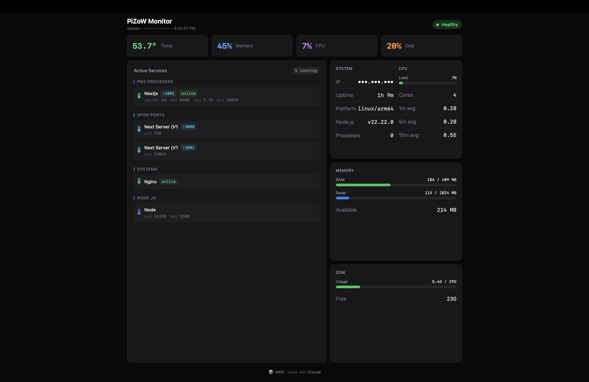

# PiZoW

> Turn your Raspberry Pi Zero W into a lightweight home server — with deployment scripts, process management, and a real-time monitoring dashboard.

<a href="screenshot/web.png">
  
</a>

---

## What is PiZoW?

PiZoW is a collection of shell scripts and a ready-to-use example project that makes it dead simple to:

- **Set up** a Raspberry Pi Zero W as a Node.js web server
- **Deploy** any Node.js app (Next.js, Express, Fastify, etc.) from your local machine
- **Monitor** your Pi in real time with a beautiful dashboard

The included **Next.js example** doubles as a fully functional **monitoring dashboard** for your Pi home server — showing CPU, memory, disk, temperature, uptime, and all running services in a single-page view. It's both a demo project and something you'll actually want to keep running.

---

## Live Dashboard Preview

The `examples/nextjs` app is a production-ready monitoring dashboard — responsive and mobile friendly. Deploy it to your Pi and access it from any browser or phone on your network.

<table>
  <tr>
    <th>Desktop</th>
    <th>Mobile</th>
  </tr>
  <tr>
    <td>
      <a href="screenshot/web.png">
        
      </a>
    </td>
    <td>
      <a href="screenshot/mobile.jpg">
        
      </a>
    </td>
  </tr>
</table>

**What it shows:**
- Temperature, Memory %, CPU %, Disk % — at a glance
- All running services: PM2 processes, open ports, systemd units, Node.js processes
- System info: IP (masked by default, click to reveal), uptime, platform, Node version
- CPU load averages (1m / 5m / 15m) and core count
- RAM and Swap usage with visual progress bars
- Disk usage and free space
- Auto-refreshes every 5 seconds
- Responsive — works on desktop and mobile

---

## Quick Start

### 1. Flash Your SD Card

Use [Raspberry Pi Imager](https://www.raspberrypi.com/software/):

**Settings (click the gear icon ⚙️):**
- Enable SSH
- Set username and password
- Configure WiFi
- Set locale

**OS: Any Debian-based Linux** (Ubuntu, Raspberry Pi OS, etc.)

> This project was built and tested on **[Ubuntu 24.04.4 LTS (Noble Numbat)](https://ubuntu.com/download/raspberry-pi)** on a Raspberry Pi Zero 2 W. Any Debian-based OS should work — Ubuntu and Raspberry Pi OS Lite are both good choices.
>
> Download Ubuntu for Raspberry Pi: [ubuntu.com/download/raspberry-pi](https://ubuntu.com/download/raspberry-pi)

### 2. SSH into Your Pi

```bash
ssh YOUR_USERNAME@YOUR_PI_IP
```

### 2a. (Recommended) Set Up SSH Key Auth

After first login, copy your key to the Pi so you never need a password again. The deploy scripts will use it automatically.

```bash
ssh-copy-id YOUR_USERNAME@YOUR_PI_IP
```

> **Why:** `PI_PASSWORD` in `.env` is only needed for the first-time `setup-pi.sh` run. Once your SSH key is installed, you can remove it from `.env`. All subsequent deploys use key auth.

### 3. Run the Setup Script

On your Pi:

```bash
curl -sSL https://raw.githubusercontent.com/YOUR_USERNAME/pizow/main/scripts/setup-pi.sh | bash
```

Or clone and run locally:

```bash
git clone https://github.com/YOUR_USERNAME/pizow.git
cd pizow
./scripts/setup-pi.sh
```

This installs Node.js 20, PM2, Nginx, and configures 1 GB swap (essential for Pi Zero).

### 4. Configure Your Environment

```bash
cp .env.example .env
```

Edit `.env`:

```bash
PI_USER=your_username
PI_HOST=192.168.x.x
PROJECT_NAME=myapp
PROJECT_PATH=/home/your_username/myapp
LOCAL_PATH=/path/to/your/local/project   # for local deploy
REPO_URL=git@github.com:you/myapp.git    # for remote deploy
PORT=3000
PM2_APP_NAME=myapp
```

### 5. Deploy

```bash
# Build on your Mac, rsync output to Pi (recommended for Pi Zero — less RAM pressure)
./scripts/deploy.sh

# Or have the Pi pull from GitHub and build itself
./scripts/deploy.sh --remote

# Just restart without rebuilding
./scripts/deploy.sh --restart
```

---

## Deploy the Monitoring Dashboard

The `examples/nextjs` app is ready to deploy as-is. It runs as your Pi's home dashboard.

```bash
# Set LOCAL_PATH to the nextjs example in your .env
LOCAL_PATH=./examples/nextjs

# Deploy it
./scripts/deploy.sh
```

Then open `http://YOUR_PI_IP` in any browser on your network.

---

## Project Structure

```
pizow/
├── scripts/
│   ├── setup-pi.sh          # One-time Pi setup (Node, PM2, Nginx, swap)
│   ├── deploy.sh            # Deploy via local rsync or git pull
│   ├── deploy-standalone.sh # Build locally + rsync prebuilt output
│   ├── nginx-setup.sh       # Configure Nginx reverse proxy
│   ├── health-check.sh      # Pi health check (CPU, mem, disk, temp)
│   └── manage.sh            # List, stop, kill, remove deployed apps
├── examples/
│   ├── nextjs/              # Monitoring dashboard + Next.js demo
│   └── node-api/            # Express API with health, echo, CRUD endpoints
├── .env.example
└── README.md
```

---

## Scripts Reference

### `setup-pi.sh`

Run once on a fresh Pi. Installs and configures everything:

- Node.js 20.x
- PM2 (process manager with autostart)
- Nginx (reverse proxy)
- 1 GB swap file

### `deploy.sh`

```bash
./scripts/deploy.sh [--local] [--remote] [--restart]
```

| Flag | Description |
|------|-------------|
| `--local` | Build on your machine, rsync output to Pi (default) |
| `--remote` | Pi pulls from git and builds there |
| `--restart` | Skip build/sync, just restart PM2 |

### `manage.sh`

```bash
./scripts/manage.sh list                          # List running apps and ports
./scripts/manage.sh stop 3000                     # Gracefully stop app on port
./scripts/manage.sh kill 3000                     # Force kill
./scripts/manage.sh remove /home/user/myapp       # Stop and delete project
./scripts/manage.sh logs                          # View default logs
./scripts/manage.sh logs /tmp/myapp.log           # View specific log
./scripts/manage.sh restart /home/user/myapp 3000 # Restart app
./scripts/manage.sh services status               # List systemd services
./scripts/manage.sh services stop myservice       # Stop a systemd service
./scripts/manage.sh services start myservice      # Start a systemd service
```

### `nginx-setup.sh`

Configures Nginx as a reverse proxy for your app on port 80.

### `health-check.sh`

Prints CPU temp, memory, disk, and uptime. Useful for quick SSH checks.

---

## Examples

### Next.js Monitoring Dashboard (`examples/nextjs`)

A real-time Pi monitoring dashboard — the same one shown in the screenshot above.

- Single-page layout, no scrolling
- Auto-refreshes every 5 seconds
- IP address masked by default (click to reveal)
- Expand toggle when services overflow
- Works on mobile

Deploy it as your Pi's home page and always know what's running.

### Node.js API (`examples/node-api`)

A minimal Express API with:
- `GET /health` — health check endpoint
- `GET /info` — system info
- `POST /echo` — echo endpoint
- Basic CRUD example routes

Good starting point for building your own Pi backend.

---

## Architecture

```
Browser
  │
  ▼ HTTP/HTTPS
┌────────────────────────────┐
│     Raspberry Pi Zero W    │
│                            │
│  Nginx (port 80/443)       │
│  └─ Reverse proxy          │
│     │                      │
│     ▼                      │
│  PM2                       │
│  └─ Process manager        │
│     │  Auto-restart        │
│     │  Boot startup        │
│     ▼                      │
│  Your Node.js App          │
│  (Next.js / Express / ...) │
└────────────────────────────┘
```

---

## Useful Commands on the Pi

```bash
# PM2
pm2 status                  # App status
pm2 logs APP_NAME           # Live logs
pm2 restart APP_NAME        # Restart
pm2 monit                   # Real-time resource monitor

# System
htop                        # Process viewer
free -h                     # Memory
df -h                       # Disk
vcgencmd measure_temp       # CPU temperature
uptime                      # Uptime

# Nginx
sudo systemctl status nginx
sudo nginx -t               # Test config
sudo tail -f /var/log/nginx/error.log
```

---

## Troubleshooting

### Can't SSH to Pi
- Double-check WiFi credentials set in Imager
- Confirm SSH is enabled
- Try `ping raspberrypi.local` or check your router's DHCP list

### Out of Memory / Build Fails

```bash
# Increase swap to 2 GB
sudo swapoff /swapfile
sudo fallocate -l 2G /swapfile
sudo mkswap /swapfile
sudo swapon /swapfile
```

### App Won't Start

```bash
pm2 logs APP_NAME --lines 100
sudo lsof -i :3000          # Check if port is already in use
```

### PM2 Crash-Looping

Usually means PM2 is using a stale start command from a previous deploy.

```bash
pm2 delete APP_NAME

# Standalone Next.js (server.js, no node_modules)
PORT=3000 HOSTNAME=0.0.0.0 pm2 start server.js --name APP_NAME

# Regular Node.js app
pm2 start npm --name APP_NAME -- start

pm2 save
```

### Nginx 502 Bad Gateway

```bash
pm2 status                           # Is the app actually running?
sudo nginx -t                        # Config syntax OK?
sudo tail -f /var/log/nginx/error.log
```

### High CPU Temperature

```bash
vcgencmd measure_temp
# Over 80°C? Add a heatsink or reduce workload
```

---

## Requirements

- Raspberry Pi Zero W or Zero 2 W
- Any Debian-based OS on the Pi (tested on **[Ubuntu 24.04.4 LTS](https://ubuntu.com/download/raspberry-pi)**)
- macOS or Linux on your development machine
- Node.js 18+ locally (for building)
- SSH access to your Pi

---

## Contributing

1. Fork the repo
2. Create a branch: `git checkout -b feature/my-change`
3. Commit: `git commit -m 'Add my change'`
4. Push: `git push origin feature/my-change`
5. Open a Pull Request

---

## License

MIT — see [LICENSE](LICENSE)

---

## Resources

- [Raspberry Pi Documentation](https://www.raspberrypi.com/documentation/)
- [PM2 Documentation](https://pm2.keymetrics.io/docs/)
- [Nginx Documentation](https://nginx.org/en/docs/)
- [Next.js Documentation](https://nextjs.org/docs)
