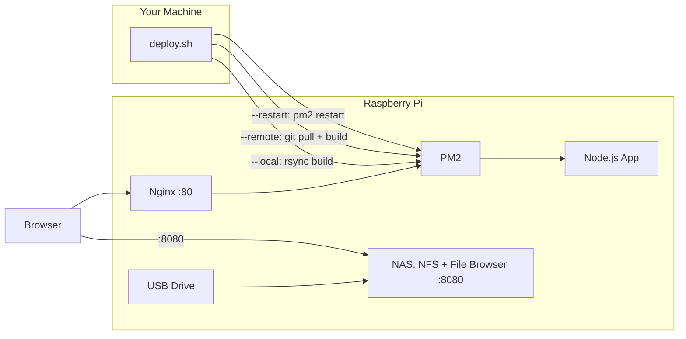

# PiZoW

> Turn your Raspberry Pi Zero W into a lightweight home server — with deployment scripts, process management, a real-time monitoring dashboard, and NAS storage via USB.
>
> Built and tuned for the Pi Zero 2 W's tight RAM/power budget, but every script works unmodified on any Raspberry Pi (3, 4, 5, etc.) — see [Requirements](#requirements).


---

## What is PiZoW?

PiZoW is a collection of shell scripts and a ready-to-use Next.js dashboard that makes it dead simple to:

- **Set up** any Raspberry Pi (Zero W and up) as a Node.js web server
- **Deploy** any Node.js app (Next.js, Express, Fastify, etc.) from your local machine
- **Monitor** your Pi in real time — CPU, memory, disk, temp, network, and all running services
- **Turn any USB drive into a NAS** — NFS share + File Browser web UI

> Also running on [Readback](https://github.com/MKS-01/readback) — a terminal read-later client built on the same Pi stack.

---

## How It Works



`deploy.sh` is the single entry point for getting code onto the Pi — it either ships a local build over rsync, tells the Pi to pull and build from git, or just restarts the running PM2 process. Nginx fronts the app on port 80; the NAS (if set up) runs independently on port 8080.

---

## Claude Code Skills

PiZoW ships with built-in [Claude Code](https://claude.ai/code) skills — invoke them directly from your terminal:

| Skill | Trigger | What it does |
|---|---|---|
| `pi-setup` | `/pi-setup` | First-time Pi setup — installs Node 22, PM2, Nginx, 1 GB swap over SSH |
| `pi-deploy` | `/pi-deploy` | Build + rsync + restart PM2. Accepts `--local`, `--remote`, `--restart` |
| `pi-status` | `/pi-status` | SSH health snapshot — PM2 processes, CPU temp, memory, disk |

Skills live in `.claude/skills/` and are picked up automatically when you open the project in Claude Code.

---

## Quick Start

### 1. Flash Your SD Card

Use [Raspberry Pi Imager](https://www.raspberrypi.com/software/) — enable SSH, set username/password, configure WiFi. **Recommended OS: Ubuntu Server 24.04 LTS.**

### 2. SSH in & set up key auth

```bash
ssh YOUR_USERNAME@YOUR_PI_IP
ssh-copy-id YOUR_USERNAME@YOUR_PI_IP
```

### 3. Run setup

```bash
curl -sSL https://raw.githubusercontent.com/MKS-01/pizow/main/scripts/setup-pi.sh | bash
```

Installs Node.js 22, PM2, Nginx, and 1 GB swap (essential for Pi Zero).

### 4. Configure `.env`

```bash
cp .env.example .env
```

Set `PI_USER`, `PI_HOST`, `PROJECT_NAME`, `PM2_APP_NAME`, and `PORT` at minimum.

### 5. Deploy

```bash
./scripts/deploy.sh           # build locally, rsync to Pi (default)
./scripts/deploy.sh --remote  # Pi pulls from git and builds itself
./scripts/deploy.sh --restart # restart PM2 only
```

Then open `http://YOUR_PI_IP` in any browser on your network.

---

## Requirements

- Any Raspberry Pi — Zero W, Zero 2 W, 3, 4, 5 (built and tested on Pi Zero 2 W)
- Any Debian-based OS (tested on [Ubuntu 24.04.4 LTS](https://ubuntu.com/download/raspberry-pi))
- macOS or Linux on your dev machine
- Node.js 22+ locally (for building)
- SSH access to your Pi

---

## Docs

- [Scripts Reference](docs/scripts.md)
- [NAS Setup](docs/nas.md)
- [Troubleshooting & Commands](docs/troubleshooting.md)
- [CLI Cheatsheet](docs/cli-cheatsheet.md) — SSH, Nmap, Docker, PM2, and Linux admin quick reference

---

## License

MIT — see [LICENSE](LICENSE)
